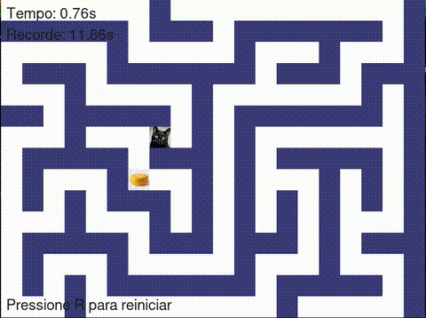

# 🐱🧀 Labirinto do Gato

Bem-vindo ao **Labirinto do Gato**! Um jogo 2D criado com auxílio de IA e lowcode, onde você guia um gato faminto por um labirinto até encontrar um delicioso pedaço de queijo. 🐾

## 🤖 Sobre o Projeto
Este projeto foi desenvolvido utilizando técnicas de lowcode e inteligência artificial para acelerar a criação do jogo, desde a lógica até a interface e sprites. O objetivo é mostrar como é possível criar jogos divertidos e completos com auxílio de IA!

## 🎮 Como Jogar
- Use as teclas de seta ou W, A, S, D para mover o gato.
- O objetivo é alcançar o queijo no menor tempo possível.
- O cronômetro é exibido na tela.
- O recorde de menor tempo é salvo automaticamente.
- Pressione `R` para reiniciar o jogo a qualquer momento.

## 🏆 Funcionalidades
- Labirinto gerado dinamicamente a cada partida
- Três níveis de dificuldade (fácil, médio, difícil)
- Sistema de recorde de tempo
- Sons de passos e vitória (opcional)
- Sprites personalizados para o gato e o queijo

## 📹 Demo
Veja o jogo em ação:



## 🚀 Instalação
1. Instale as dependências:
   ```bash
   pip install -r requirements.txt
   ```
2. Execute o jogo:
   ```bash
   python main.py
   ```

## 📂 Créditos
- Gato e queijo: sprites livres ou gerados por IA.
- Sons: livres de direitos autorais.

---

Feito com ❤️ por Brayan 